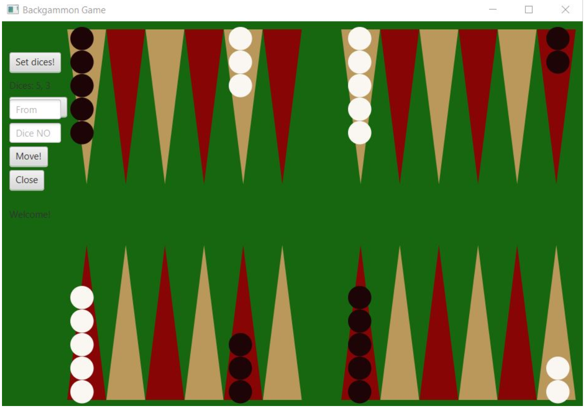

# Backgammon
# PA Project

Backgammon in Java

This application is the final project for faculty's subject Advanced Programming.

The project has a part of the logic of the backgammon game, plus a graphic representation of the table with checkers for every player.

Aplicatia se bazeaza pe comunicarea in retea, cu ajutorul socketurilor.

The server contains classes that are used for connecting two clients and a handler for every client thread.

Also, in the server folder there are classes responsible for the logic of the table, like: Player, Dice, Table.

Because the 2 players will play in different threads, for sharing the table we will use a singleton and the communication between the client and server will aim sending/receiving the updated table.

The client contains, besides the class for connecting to server, classes for moving (TableMovesInside, TableMovesOutside), classes for table's logic (GameLogic, Table, Dice).

The project also contains elements of Graphical User Interface: game table, checkers, dices generetor, box for confirming exiting the game.
